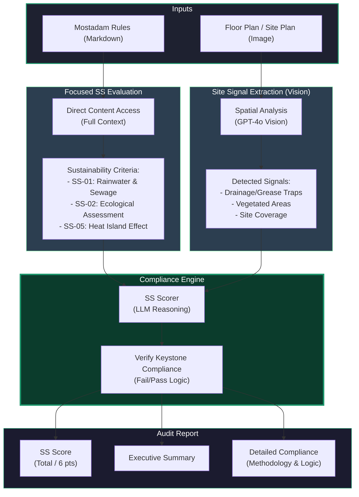

# AI Architecture Plan Auditor - System Architecture

This flowchart illustrates the end-to-end process of the AI Architecture Plan Auditor. It showcases how independent rule extraction and spatial vision analysis are combined to provide a verified sustainability assessment.

### 🧠 Strategic Advantage for Presentation:
- **Focused Compliance**: Specifically targets high-impact Site Sustainability (SS) credits.
- **Keystone Verification**: Automatically flags missing Keystone requirements (SS-01/SS-02) which are critical for certification.
- **Markdown-Optimized**: Transitioned to Markdown for maximum token efficiency and faster analysis.
- **Transparent Scoring**: The "6-Point" system clearly separates Baseline (Keystone) from Optional performance.
