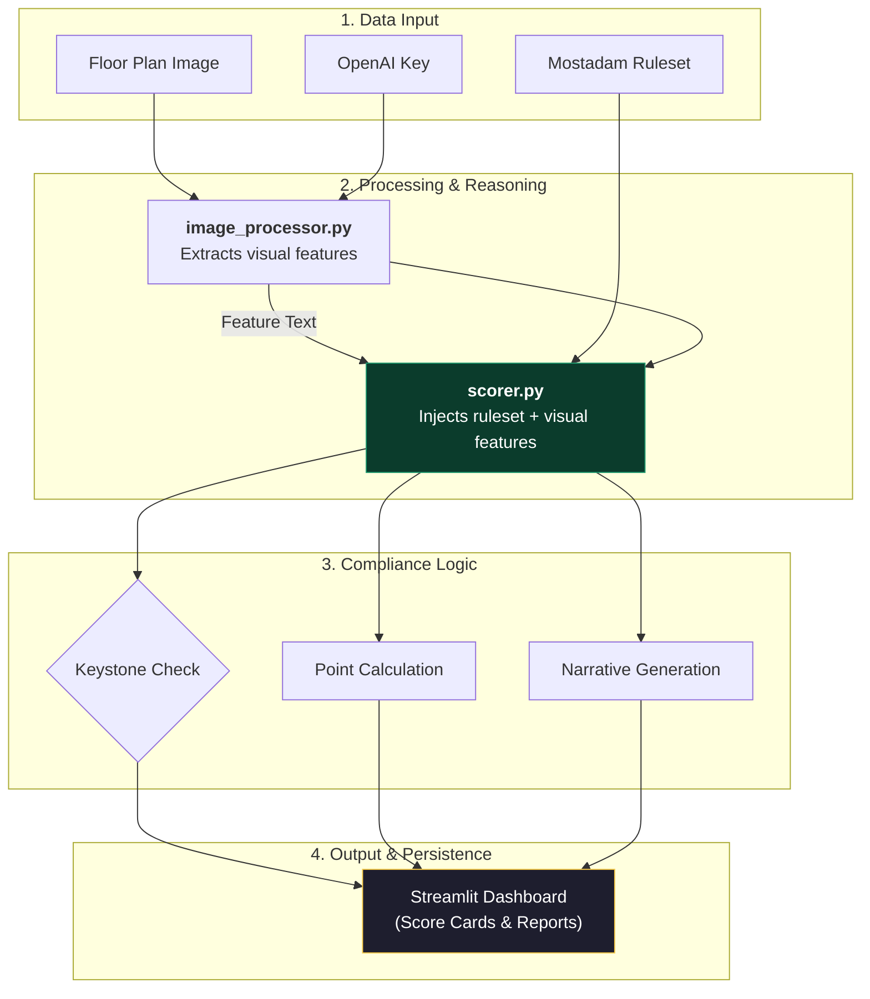
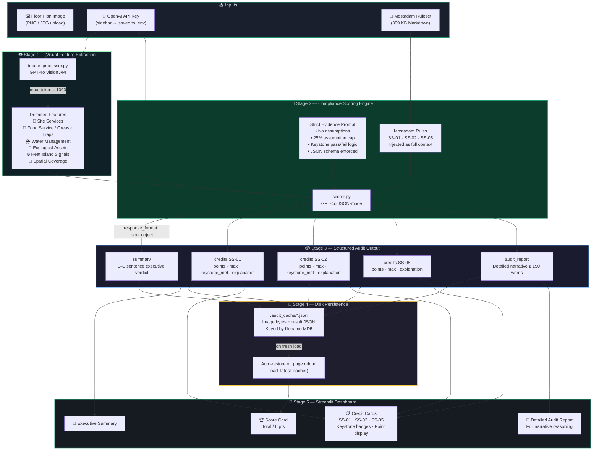

# AI Architecture Plan Auditor — System Architecture

End-to-end pipeline combining multimodal vision AI, regulatory knowledge injection, and structured LLM reasoning to produce evidence-based sustainability compliance verdicts from raw floor plan images.

---

## 🎯 Simplified Overview *(presentation)*

---

## 🔬 Detailed System Flow *(technical reference)*

---

## Component Responsibilities

| Component | File | Role |
|---|---|---|
| **Vision Extractor** | `pipeline/image_processor.py` | GPT-4o Vision → structured feature text |
| **Compliance Scorer** | `pipeline/scorer.py` | Rules + features → JSON audit verdict |
| **Disk Cache** | `app.py` → `.audit_cache/` | Persist results across page reloads |
| **Dashboard** | `app.py` | Render score, summary, cards, report |
| **Ruleset** | `Mostadam_Commercial_Buildings_DC.md` | Single source of grading truth |

---

## Design Principles

### 🔒 Strict Evidence-Only Scoring
The LLM prompt enforces a **25% assumption cap**. Features that cannot be visually confirmed (flood zone status, SRI values) are automatically flagged as *"Requires External Documentation"* rather than assumed compliant.

### ⚠️ Keystone-First Architecture
SS-01 and SS-02 are **Keystone credits** — mandatory prerequisites for Mostadam certification. The system surfaces keystone failures prominently with colour-coded badges before optional credits are considered.

### 📦 JSON-Mode Determinism
Using `response_format: { type: "json_object" }` on GPT-4o guarantees the scorer always returns a parsable, schema-compliant response — eliminating brittle string parsing and making the pipeline production-safe.

### 💾 Resilient State Management
Streamlit session state is ephemeral. The disk cache (`MD5-keyed JSON`) decouples audit results from the server process lifecycle, ensuring results survive restarts, network drops, and browser refreshes.

### 🔑 Late-Binding API Key
The `OpenAI` client is instantiated at **call-time** in both pipeline modules — not at module-import time. This ensures the key entered by the user in the sidebar is always the one used, with no stale-key bugs.
