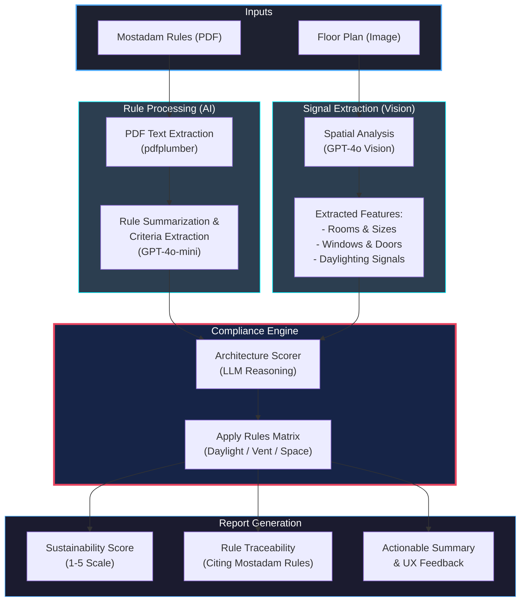

# AI Architecture Plan Auditor - System Architecture

This flowchart illustrates the end-to-end process of the AI Architecture Plan Auditor. It showcases how independent rule extraction and spatial vision analysis are combined to provide a verified sustainability assessment.

### 🧠 Strategic Advantage for Presentation:
- **Scalability**: New rules (e.g., Leed, Well) can be added simply by uploading a new PDF.
- **Explainability**: Unlike a "black box," our system cites its sources.
- **Advanced Vision**: We use proprietary Vision LLMs to understand complex spatial relationships in floor plans.
